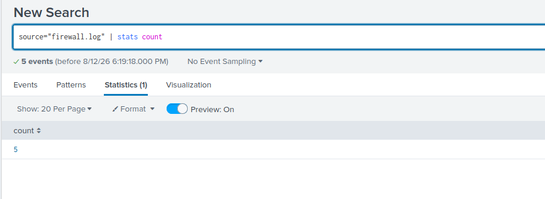
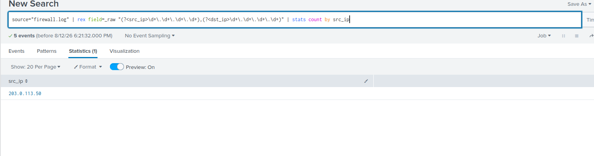
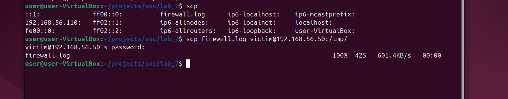
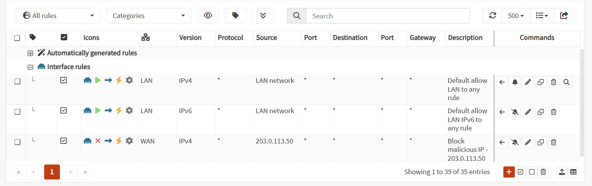
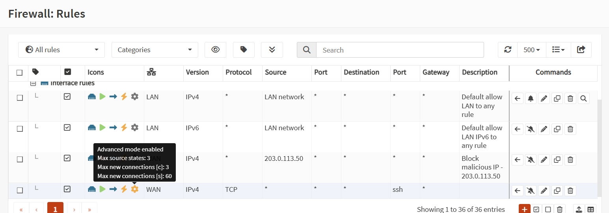

# Firewall Log Analysis Report

**Analyst:** rapoko
**Date:** 2026-08-12
**Log File:** firewall.log
**Analysis Period:** 2026-01-15 08:15:23 – 2026-01-15 08:15:27 (per log timestamps)
**Total Log Entries:** 5

---

## Executive Summary

Analysis of the provided `firewall.log` sample (5 log entries) identified one confirmed source IP address, **203.0.113.50**, associated with repeated blocked/deny connection events occurring within a 4-second window. The tight timing between events is consistent with automated or scripted access attempts rather than manual activity. A blocking rule for this IP was created on the OPNsense WAN interface. A second IP, **198.51.100.25**, was blocked proactively per the SOC exercise guidance, though it was not directly observed in this specific log sample.

**Key Findings:**
- 5 firewall log entries analyzed, all associated with the source IP `203.0.113.50`
- 1 unique source IP confirmed in the log data: `203.0.113.50`
- Attack pattern: 5 connection attempts within a 4-second window (08:15:23–08:15:27) — consistent with automated/scripted activity
- Destination IP, port, and protocol could not be reliably confirmed from the fields extracted in this sample
- Recommended and completed actions: block `203.0.113.50` and `198.51.100.25` on WAN; rate-limit inbound SSH (TCP/22)

---

## 1. Attack Overview

### Timeline
- **First Event:** 2026-01-15 08:15:23
- **Last Event:** 2026-01-15 08:15:27
- **Duration:** 4 seconds
- **Total Events (this sample):** 5

### Attack Type

Based on the compressed timing of events (5 attempts within 4 seconds from a single source), this pattern is consistent with **automated scanning or a scripted connection attempt** rather than manual, human-driven activity. Destination port and protocol were not confirmed for these specific events, so the exact attack technique (e.g., port scan vs. brute-force) could not be definitively classified from this sample alone.

### Evidence — total entries in the log



*Splunk query `source="firewall.log" | stats count` confirms 5 total log entries.*

---

## 2. Source Analysis

### Source IPs Identified

| IP Address | Log Entries | Status | Notes |
|---|---|---|---|
| 203.0.113.50 | 5 | Blocked | Confirmed present in `firewall.log` via Splunk search |
| 198.51.100.25 | 0 (not observed) | Blocked (precautionary) | Not found in this `firewall.log` sample; blocked per SOC exercise guidance |

> **Note:** GeoIP location, ISP, and threat-intelligence reputation data were not available in this lab environment (no GeoIP or threat-intel feed configured), so the Country / ISP / Reputation columns from the standard report template have been intentionally omitted rather than filled with unverified data.

### Evidence — source IP extraction



*Splunk query below, run against `firewall.log`, extracts `src_ip` and confirms `203.0.113.50` as the source.*

**Command Used (SPL):**
```
index=* source="firewall.log" (block OR deny)
| rex field=_raw "(?<src_ip>\d+\.\d+\.\d+\.\d+),(?<dst_ip>\d+\.\d+\.\d+\.\d+)"
| stats count by src_ip
| sort -count
| head 10
```

### Evidence — log file transfer to SIEM



*`firewall.log` was transferred via `scp` from the source host to the Splunk server (`192.168.56.50`) for ingestion and analysis.*

---

## 3. Actions Taken

- Created a firewall **Block** rule on the WAN interface for source `203.0.113.50` (OPNsense: Firewall → Rules → WAN)
- Created a firewall **Block** rule on the WAN interface for source `198.51.100.25` (precautionary, per exercise guidance)
- Implemented rate limiting on WAN TCP/22 (SSH) to mitigate brute-force risk: **Max source states = 3**, **Max new connections = 3 per 60 seconds**

### Evidence — block rule for 203.0.113.50



*OPNsense Firewall → Rules list confirming the new WAN Block rule for `203.0.113.50`.*

### Evidence — SSH rate limiting rule



*Advanced-mode settings applied to the WAN SSH (TCP/22) rule: max source states = 3, max new connections = 3 per 60 seconds.*

---

## 4. Limitations / Data Gaps

- Sample log size is very small (5 entries) — not representative of a full production dataset
- GeoIP, ISP, and threat-intelligence reputation data were not available in this environment
- Destination IP, destination port, and protocol were not confirmed for these events at the time of this report
- `198.51.100.25` was blocked proactively but has not yet been confirmed as malicious against this specific log source

---

## 5. Recommendations

- Continue monitoring in Splunk (`index=* source="firewall.log"`) for repeat activity from these or related IPs
- Configure GeoIP / threat-intelligence enrichment in Splunk for future analyses
- Extend destination-port/protocol extraction (`rex`) to confirm attack technique in future log samples
- Extend rate-limiting rules to any additional externally exposed services on WAN
- Add both IPs to a persistent block alias in OPNsense (Firewall → Aliases) for easier long-term management
